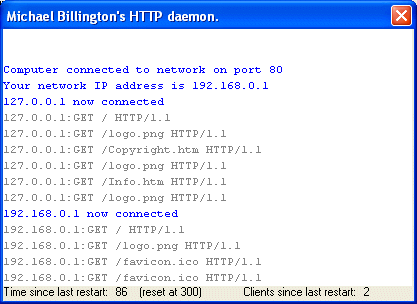



## An easy HTTP server in Visual Basic \- Does not require installation

### Description

This code is a (near complete) HTTP server coded entirely in Visual Basic. By default it will run on port 80. Uses the winsock control and can accept multiple connections on a single port. (as many as your RAM permits up to 32768) Also has a pretty good (with colour coding) output screen so you can tell what is going on, and watch connections to the server. This project is intended for anyone who wants to use VB to develop their own customised web server, tailored to their needs -- but is quite versatile, so any programmer who understands a few basics can use this code. This is my first code upload in a while, and i'm after comments more than votes so please post feedback so I can improve the code. (note: documentation included in download)
 
### More Info
 
Needs files to share to be of any real use :-) Has the documentation in that folder by default. Also needs input from the user in the browser... clicking links mainly.

Basic knowledge of winsock is assumed (and well... I mean basic), knowledge of HTTP protocol is useful to if you plan on developing this further.

Returns a HTML page or file to the user who requested it, it's that easy :-)

May not work without some configuration outside of your local network if you are behind a proxy.

             |
---                |---
**Submitted On**   |2006-09-23 22:56:38
**By**             |[stegasaurus](https://github.com/Planet-Source-Code/PSCIndex/blob/master/ByAuthor/stegasaurus.md)
**Level**          |Intermediate
**User Rating**    |5.0 (50 globes from 10 users)
**Compatibility**  |VB 6\.0
**Category**       |[Internet/ HTML](https://github.com/Planet-Source-Code/PSCIndex/blob/master/ByCategory/internet-html__1-34.md)
**World**          |[Visual Basic](https://github.com/Planet-Source-Code/PSCIndex/blob/master/ByWorld/visual-basic.md)
**Archive File**   |[An\_easy\_HT2021449232006\.zip](https://github.com/Planet-Source-Code/stegasaurus-an-easy-http-server-in-visual-basic-does-not-require-installation__1-66630/archive/master.zip)

